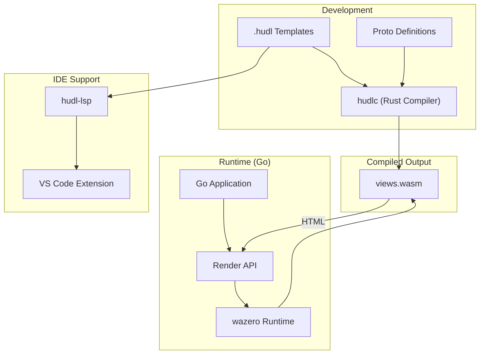
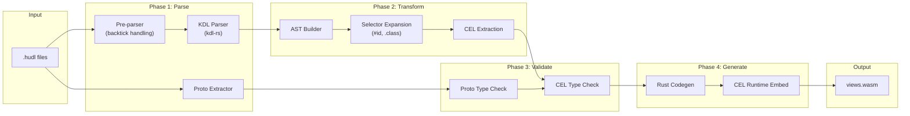
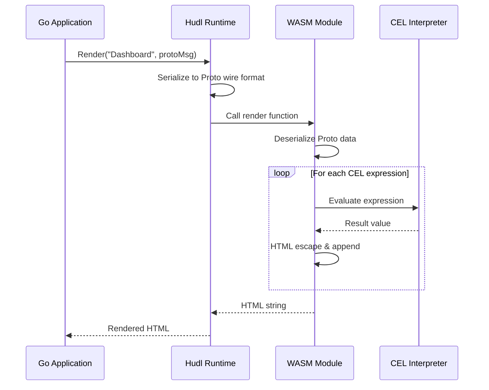
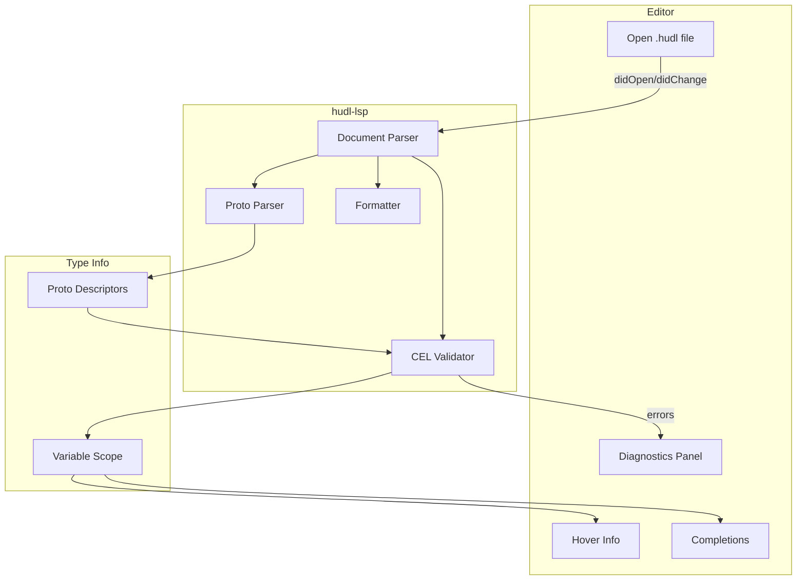
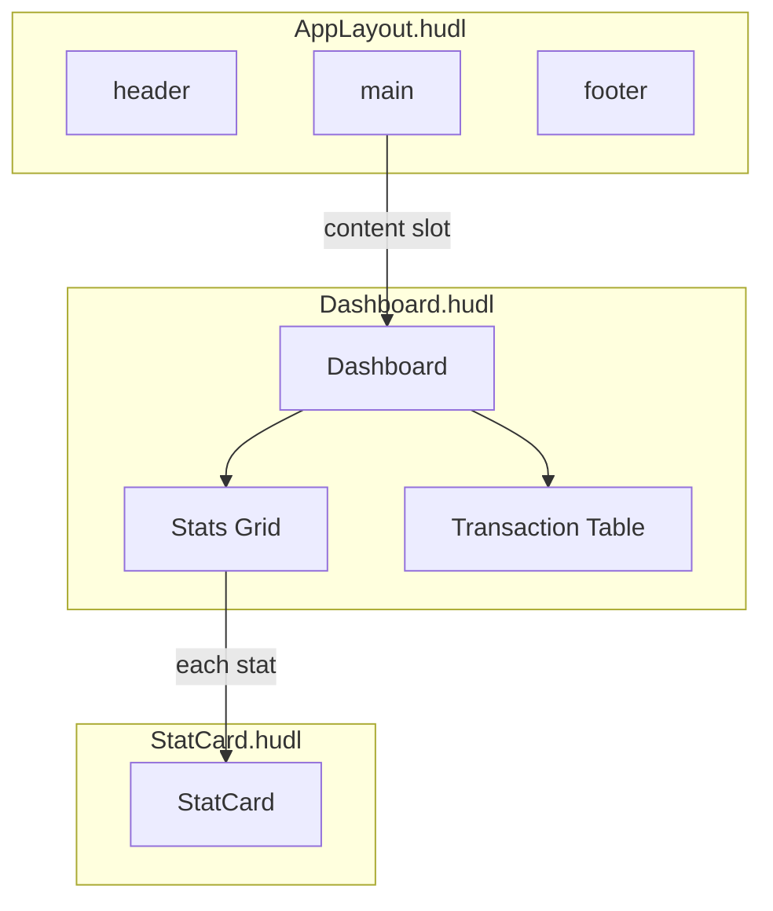
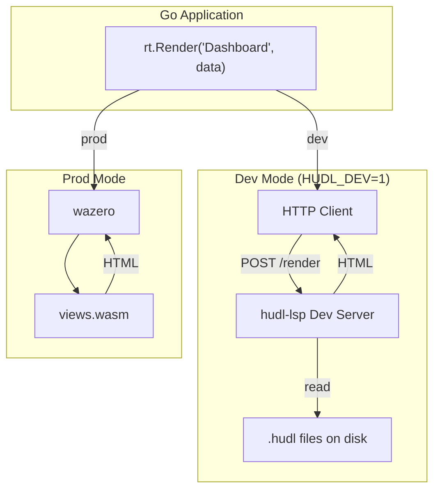
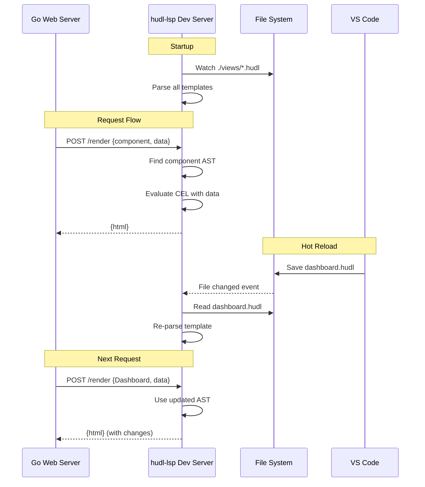

# Hudl Architecture & Design

## Overview

Hudl is a WASM-native templating language that compiles KDL-based templates into WebAssembly modules. It uses **Protocol Buffers** for type-safe data contracts and **CEL (Common Expression Language)** for expressions.

### System Components

1. **Compiler (`hudlc`)**: Rust CLI that compiles `.hudl` files into a WASM binary
2. **Runtime**: Host libraries (Go, etc.) that load WASM modules and render views
3. **LSP (`hudl-lsp`)**: Language server providing IDE features

### Technology Stack

| Component | Technology |
|-----------|------------|
| Compiler | Rust |
| Target | WebAssembly (WASM) |
| Template Syntax | KDL v2 |
| Type System | Protocol Buffers (proto3) |
| Expressions | CEL (Common Expression Language) via `cel-rust` |
| Go Runtime | `wazero` |
| LSP | `tower-lsp` (Rust) |

### Architecture Diagrams

#### System Overview



#### Compiler Pipeline



#### Runtime Data Flow



#### LSP Architecture



---

## Template Syntax

### Basic Structure

A Hudl template file (`.hudl`) consists of:

1. **Proto definitions** - Type declarations in `/**` comments
2. **Component metadata** - Name and data type in `//` comments
3. **Element tree** - KDL nodes representing HTML structure

```kdl
/** import "models/user.proto"; */

// name: UserCard
// data: User

el {
    div.card {
        h2 `name`
        p `email`
    }
}
```

### Proto Definitions

Proto definitions are embedded in comments starting with `/**`. These contain valid proto3 syntax.

#### Importing External Protos

```kdl
/** import "path/to/models.proto"; */
/** import "google/protobuf/timestamp.proto"; */
```

Paths are relative to the `.hudl` file.

#### Inline Message Definitions

```kdl
/**
syntax = "proto3";

message SearchRequest {
    string query = 1;
    int32 page_number = 2;
    int32 results_per_page = 3;
}
*/
```

#### Inline Enums

```kdl
/**
enum Status {
    STATUS_UNKNOWN = 0;
    STATUS_ACTIVE = 1;
    STATUS_PENDING = 2;
    STATUS_FAILED = 3;
}
*/
```

### Component Metadata

Components declare their name and expected data type:

```kdl
// name: ComponentName
// data: MessageType
```

- `name`: Exported function name in WASM (PascalCase recommended)
- `data`: Proto message type (can be fully qualified: `myapp.models.User`)

Components with no data requirement omit the `// data:` line.

---

## CEL Expressions

All dynamic expressions use **CEL (Common Expression Language)** enclosed in backticks.

### Basic Syntax

Backtick expressions can be used directly without quotes:

```kdl
span `title`
a href=`user.profile_url` "View Profile"
input value=`query` placeholder="Search..."
```

Quoted form is also valid but not required:

```kdl
span "`title`"           // Also valid
a href="`user.url`"      // Also valid
```

### Text Interpolation

For mixing static text with dynamic values, use quotes with embedded backticks:

```kdl
span "Hello, `user.name`!"
p "You have `size(messages)` unread messages."
p "`string(system_load)`%"
```

### Standalone Expressions

```kdl
div {
    `formatted_content`
}
```

### Field Access

CEL uses proto field names (snake_case):

```kdl
// Given: message User { string first_name = 1; }
span `user.first_name`
```

### Built-in Functions

CEL provides standard functions:

| Function | Description | Example |
|----------|-------------|---------|
| `size(x)` | Length of string/list/map | `size(items) > 0` |
| `has(x.field)` | Check if optional field is set | `has(user.middle_name)` |
| `type(x)` | Get type of value | `type(value) == string` |
| `int(x)` | Convert to integer | `int(page_str)` |
| `string(x)` | Convert to string | `string(count)` |
| `timestamp(x)` | Create timestamp | `timestamp(created_at)` |
| `duration(x)` | Create duration | `duration("1h30m")` |
| `matches(pattern)` | Regex match | `name.matches('^[a-z]+$')` |

### Custom Functions

#### `raw(html)`

Renders HTML without escaping (use for trusted content only):

```kdl
div `raw(trusted_html_content)`
```

**Warning**: Only use with sanitized/trusted content to prevent XSS.

---

## Control Flow

Control flow nodes use CEL expressions in backticks.

### Conditionals (`if` / `else`)

```kdl
if `user.is_active` {
    span.badge.active "Active"
}
else {
    span.badge.inactive "Inactive"
}
```

For `else if`, use nesting:

```kdl
if `user.role == "admin"` {
    span "Administrator"
}
else {
    if `user.role == "moderator"` {
        span "Moderator"
    }
    else {
        span "Member"
    }
}
```

### Switch / Case

```kdl
switch `status` {
    case STATUS_ACTIVE {
        span.text-green-500 "Active"
    }
    case STATUS_PENDING {
        span.text-yellow-500 "Pending"
    }
    case STATUS_FAILED {
        span.text-red-500 "Failed"
    }
    default {
        span.text-gray-500 "Unknown"
    }
}
```

#### Case Expressions

Cases can use:

- **Enum values**: `case STATUS_ACTIVE { }` - validated against enum definition at compile time
- **String literals**: `case "active" { }` - for string switch expressions
- **CEL expressions**: `case`matches('^admin.*')` { }` - implicit receiver is the switch value

### Iteration (`each`)

```kdl
each item `items` {
    li `item.name`
}
```

#### Syntax

```text
each <binding> `<cel-expression>` { ... }
```

- `<binding>`: Variable name for current item
- `<cel-expression>`: Must evaluate to an iterable (list, map, repeated field)

#### Magic Variables

Inside an `each` block:

| Variable | Description |
|----------|-------------|
| `<binding>` | Current item |
| `_index` | Zero-based index (int) |

```kdl
each user `users` {
    tr {
        td `_index + 1`
        td `user.name`
    }
}
```

#### Iterating Maps

For proto `map` fields, items are map entries:

```kdl
/**
message Stats {
    map<string, int32> counts = 1;
}
*/

each entry `counts` {
    dt `entry.key`
    dd `entry.value`
}
```

#### Filtering and Transforming

Use CEL list operations:

```kdl
// Filter
each user `users.filter(u, u.is_active)` {
    li `user.name`
}

// Map
each name `users.map(u, u.name)` {
    li `name`
}

// Filter + Map
each email `users.filter(u, u.is_admin).map(u, u.email)` {
    li `email`
}
```

---

## Component Composition

Components can invoke other components, enabling reusable UI building blocks.



### Invoking a Component

```kdl
// In parent component
each user `users` {
    UserCard `user`
}
```

Syntax: `ComponentName \`\``

The CEL expression must evaluate to a value compatible with the target component's `// data:` type.

### Type Checking

The compiler validates that the data passed to a component matches its expected type:

```kdl
/**
message User { string name = 1; }
message Order { string id = 1; }
*/

// name: UserCard
// data: User

// name: OrderList
// data: Order

el {
    // ERROR: User is not compatible with Order
    OrderList `user`
}
```

### Components Without Data

Components that take no data are invoked without an argument:

```kdl
// name: Footer
// (no data declaration)

el {
    footer {
        p "© 2024"
    }
}

// Usage in another component:
Footer
```

---

## HTML Generation

### Elements

Standard HTML elements use their tag name:

```kdl
div { }
span "text"
a href="/" "Home"
```

### CSS Shorthand

Hudl supports Emmet-style shortcuts:

| Syntax | Output |
|--------|--------|
| `div.foo` | `<div class="foo">` |
| `div.foo.bar` | `<div class="foo bar">` |
| `div#main` | `<div id="main">` |
| #my-id | `<div id="my-id">` |
| `.my-class` | `<div class="my-class">` |
| `div.foo#bar` | `<div class="foo" id="bar">` |

### Attributes

```kdl
input type="text" name="query" placeholder="Search"
a href="/" target="_blank" "Link"
```

#### Boolean Attributes

Boolean attributes are present when true, absent when false:

```kdl
input type="checkbox" checked=`is_selected`
button disabled=`!can_submit` "Submit"
```

Output when `is_selected` is true:

```html
<input type="checkbox" checked>
```

Output when `is_selected` is false:

```html
<input type="checkbox">
```

#### Dynamic Attributes

```kdl
div class=`"card " + (is_active ? "active" : "inactive")` { }
a href=`base_url + "/" + item.slug` `item.title`
```

### Special Elements

| Hudl | HTML Output |
|------|-------------|
| `_stylesheet "/style.css"` | `<link rel="stylesheet" href="/style.css">` |
| `_script "/app.js"` | `<script src="/app.js"></script>` |

### Text Content

```kdl
// Bare word (no spaces)
span Hello

// Quoted string
span "Hello, World!"

// With interpolation
span "Hello, `user.name`!"
```

### HTML Escaping

All CEL string output is HTML-escaped by default:

```kdl
// If user.bio contains "<script>alert('xss')</script>"
p `user.bio`
// Renders: <p>&lt;script&gt;alert('xss')&lt;/script&gt;</p>
```

Use `raw()` for trusted HTML:

```kdl
div `raw(sanitized_html)`
```

---

## Error Handling

### Compile-Time Errors

The compiler and LSP detect:

- Invalid CEL syntax
- Unknown proto fields/messages
- Type mismatches in component invocations
- Missing required fields

### Runtime Errors

If a CEL expression fails at runtime:

- An `ERROR` placeholder is inserted in the output
- Hover tooltip shows the error description
- Rendering continues (fail-soft)

```html
<!-- Example runtime error output -->
<span title="CEL error: no such field 'unknown_field' on User">ERROR</span>
```

---

## Compiler Pipeline

1. **Parse**: Read `.hudl` files, extract proto definitions and KDL structure
2. **Proto Compile**: Parse proto definitions, build type descriptors
3. **Validate**: Type-check all CEL expressions against proto schemas
4. **Codegen**: Generate Rust code with embedded `cel-rust` evaluation
5. **WASM Build**: Compile to `wasm32-unknown-unknown`

### Output

The compiler produces a single `.wasm` file containing:

- All component render functions
- CEL interpreter (`cel-rust`)
- Proto descriptors for runtime type handling

---

## Runtime Integration

Hudl supports two rendering modes with **identical Go code**:

- **Dev Mode**: Templates rendered by LSP sidecar (hot reload, no recompile)
- **Prod Mode**: Templates rendered by embedded WASM (fast, self-contained)

### Mode Selection



### Go Runtime API

```go
import "github.com/user/hudl/pkg/hudl"

// Create runtime - automatically detects mode from HUDL_DEV env var
rt, err := hudl.NewRuntime(ctx, hudl.Options{
    // Dev mode: LSP server address (default: localhost:4567)
    DevServerAddr: "localhost:4567",
    // Prod mode: WASM bytes or file path
    WASMBytes: wasmBytes,
    // Or load from file
    WASMPath: "views.wasm",
})
defer rt.Close()

// Render - works identically in both modes
html, err := rt.Render("Dashboard", dashboardData)
```

### Environment Variables

| Variable | Description | Default |
|----------|-------------|---------|
| `HUDL_DEV` | Enable dev mode (`1` or `true`) | `false` |
| `HUDL_DEV_ADDR` | LSP dev server address | `localhost:4567` |

### Dev Mode Benefits

- **Hot Reload**: Edit `.hudl` files and see changes immediately
- **No Recompilation**: Go binary stays running, only templates change
- **Better Errors**: LSP provides detailed error messages with line numbers
- **Rapid Iteration**: Designers can tweak templates without developer involvement

### Data Flow

#### Prod Mode (WASM)

1. Host serializes proto message to wire format
2. WASM module deserializes into CEL-compatible structure
3. CEL expressions evaluate against the data
4. HTML string is built and returned to host

#### Dev Mode (LSP Sidecar)

1. Host has proto message (same as prod mode)
2. HTTP POST to LSP dev server with component name + proto wire bytes
3. LSP parses current `.hudl` file from disk
4. LSP deserializes proto and evaluates CEL expressions
5. HTML returned via HTTP response

---

## LSP Dev Server

In development, the LSP runs an HTTP server that acts as a rendering sidecar.

### Starting Dev Server

```bash
# Start LSP with dev server enabled
hudl-lsp --dev-server --port 4567 --watch ./views

# Or via environment
HUDL_DEV_PORT=4567 hudl-lsp --dev-server
```

### Dev Server API

#### POST /render

Render a component with provided data (protobuf wire format).

**Request:**
- Header: `X-Hudl-Component: Dashboard`
- Header: `Content-Type: application/x-protobuf`
- Body: Protobuf wire-format bytes of the component's data message

**Response (success):**
- Header: `Content-Type: text/html; charset=utf-8`
- Header: `X-Hudl-Render-Time-Ms: 2.3`
- Body: Rendered HTML string

**Response (error):**
- Status: `400 Bad Request`
- Header: `Content-Type: application/json`
- Body:
```json
{
  "error": "Unknown field 'revnue_formatted' on DashboardData",
  "file": "dashboard.hudl",
  "line": 36,
  "column": 20
}
```

#### GET /health

Health check endpoint.

```json
{
  "status": "ok",
  "templates_loaded": 7,
  "last_reload": "2024-01-15T10:30:00Z"
}
```

### File Watching

The dev server watches `.hudl` files for changes:

1. File change detected
2. Re-parse affected templates
3. Invalidate cached AST
4. Next render uses updated template

No restart required - changes are picked up automatically.

### Dev Server Architecture



---

## LSP Features

### Diagnostics

- Proto syntax errors
- CEL expression validation
- Unknown field/type references
- Component type mismatches

### Semantic Highlighting

| Token Type | Examples |
|------------|----------|
| Keyword | `if`, `else`, `switch`, `case`, `default`, `each` |
| Component | `UserCard`, `Layout` |
| Type | Proto message names |
| Variable | CEL identifiers |
| String | Quoted text, CEL strings |

### Formatting

- Consistent indentation
- Selector normalization (`div class="foo"` → `div.foo`)
- Attribute ordering

### Hover Information

- Proto field types
- CEL expression types
- Component signatures

---

## Directory Structure

```text
project/
├── proto/
│   ├── models.proto
│   └── views.proto
├── views/
│   ├── layout.hudl
│   ├── dashboard.hudl
│   └── components/
│       ├── user_card.hudl
│       └── stat_card.hudl
├── cmd/
│   └── server/
│       └── main.go
└── views.wasm          # Compiled output
```

---

## Grammar Summary

```text
file        = proto_block* metadata element

proto_block = "/**" proto3_syntax "*/"

metadata    = name_decl data_decl?
name_decl   = "// name:" identifier
data_decl   = "// data:" type_path

element     = "el" "{" node* "}"

node        = element_node | control_node | component_node | text

element_node = tag_expr attributes? content?

content     = cel_expr | string | "{" node* "}"

tag_expr    = (tag | "#" id | "." class) ("." class | "#" id)*

attributes  = (identifier "=" attr_value)*
attr_value  = cel_expr | string | bare_word

control_node = if_node | switch_node | each_node

if_node     = "if" cel_expr "{" node* "}" ("else" "{" node* "}")?

switch_node = "switch" cel_expr "{" case_node* default_node? "}"
case_node   = "case" (identifier | cel_expr | string_literal) "{" node* "}"
default_node = "default" "{" node* "}"

each_node   = "each" identifier cel_expr "{" node* "}"

component_node = identifier cel_expr?

cel_expr    = "`" cel_syntax "`"

string      = bare_word | quoted_string
quoted_string = '"' (char | cel_interpolation)* '"'
cel_interpolation = "`" cel_syntax "`"
```

### Pre-parse Transformation

Before KDL parsing, the pre-parser wraps backtick expressions in quotes:

```text
Input:   href=`user.url`
Output:  href=#"`user.url`"#

Input:   span `title`
Output:  span #"`title`"#

Input:   div class=`is_admin ? "admin" : "user"`
Output:  div class=#"`is_admin ? "admin" : "user"`"#
```

The `#"..."#` raw string syntax (KDL v2) preserves inner double quotes in CEL expressions.
This allows backticks to be used as unquoted values while maintaining KDL compatibility.
